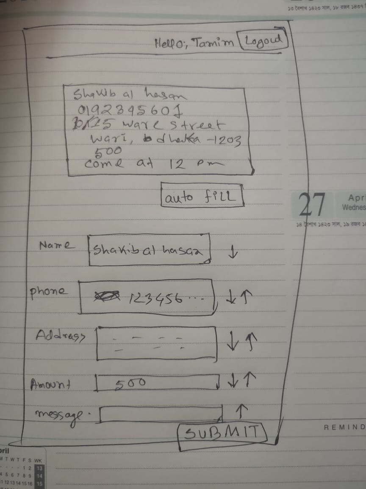

## Getting Started

We expect you're using Node 12+, Next.js 10 doesn't work well with old versions of Node

First, run the development server

```bash
npm run dev
```

Open [http://localhost:3000](http://localhost:3000) with your browser to see the ****result****.

Learning Resources have been given on the home page of this site.
## Story 


Let's consider, we have a simple website which will be used by
people who are running business through facebook page. They will upload/create an order in our website and we'll manage the delivery for them. We'll collect the parcel from them, do necessary packaging, contact with the actual customer and do the final doorstep delivery

 Note  -- > **Seller == Merchant == Now's customer**


They(Merchant) generally get/receive product orders through messenger/page inbox. And seller ask them to provide Name,Phone and Address.


Customer generally provides information in the following order

```
Shakib Al Hasan
01712233445
10/81 Tejkuni para, Mohagonj, Kumilla
```

Now we need to facilitate our customer's delivery request in our website. Apart from the customer information, they need to provide the amount we need to collect from the end user, and any special message or comment

## Assignment

You are asked to build two 2 simple pages using the code template provided in this repo.

1. Login Page
2. Order page

You'll be creating a fake/demo login api provided by the following site. You'll get token after 
successful login. Which you'll be using as `Authorization` Header in the order page

```
https://reqres.in/
```


Once the user is logged, you'll redirect them `/order` page. If they are already logged in, they should also be redirected to order page.


Order page will have an option to logout(from browser, no need to call api)

This page will have a text area where merchant will be able to paste the text from messenger he received on his facebook page.


The page will also have 5 text input fields along with some special buttons. The mockup page layout is given in the link




The arrows along with the text field will be used for swapping text values between two text field.


Merchant can always manually change input values. In the bottom there will be a submit, you need to submit the data in a api that is created in this next.js application. The response doesn't matter. You just need to create the api. Make sure you're passing the login token in the header.


Evaluation criteria
1. Site responsiveness - You're an awesome front end developer, you want users to visit from mobile, right?. Any CSS framework is acceptable and encouraged(matrial, Ant, bootstrap)
2. Coding standard. Please keep the code formatting and standards sane. Use Eslint or Typescript. No ES5 please!
3. Site functionality. site should not ask to login if he's logged in and refresh page in the orders page. order page has functionality is described above
4. Proper use state management. While the app is fairly simple, we'd want to see how you organize and setup the project to be extensible for large codebase.
5. Site need not to be too beautiful but also make sure it doesn't look ugly! After all you're a fronend superstar


Best of Luck! We know you're awesome, but let's show other candidates as well that you're better than rest!